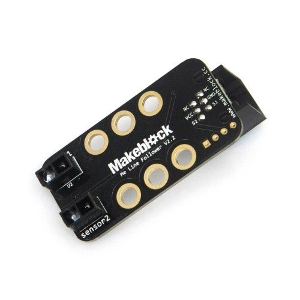
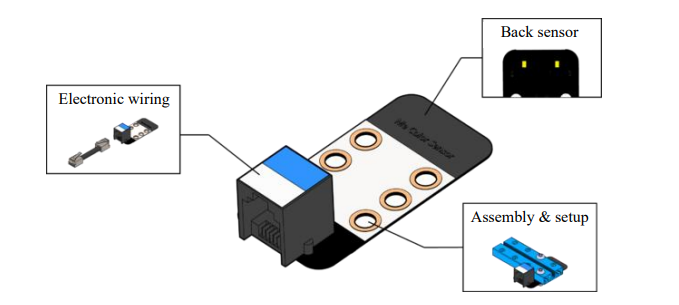
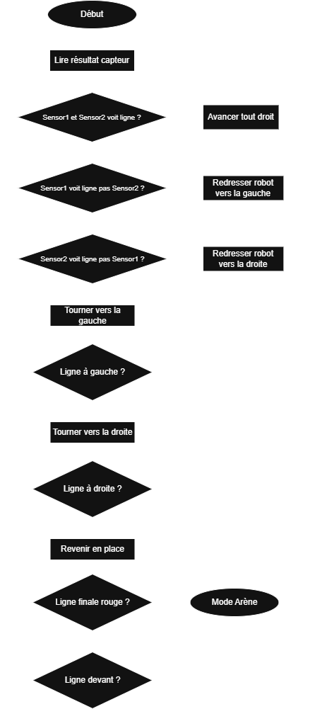

# mbot-V1-rescue-line

Ce repo contient le rapport entier de notre projet (Gabriel et Brice) sur le robot Rescue Line pour le projet de Science de l'ingénieur 2025.

## I - Suivi de ligne

### 1) Introduction au robot

-------------------------------------------------------------------------------------------------------------------------------------------------------------------------------------------------------------------------

Le robot part d'une base mbot V1. Il fonctionne avec, pour la partie suivi de ligne, 2 modules, un module de suivi de ligne et un module de détection de couleur. De plus, il a 2 moteurs principaux reliés à 2 roues, ainsi qu'une roue universelle à bille en acier sous vide à l'avant pour faire tenir le robot.

-------------------------------------------------------------------------------------------------------------------------------------------------------------------------------------------------------------------------

### 2) Principe de détection

-------------------------------------------------------------------------------------------------------------------------------------------------------------------------------------------------------------------------

La détection de la ligne est assurée par le module de suivi de ligne.

Ce module est composé de 2 capteurs qui vérifie si ils sont sur une ligne noir ou pas. Ainsi, ces capteurs sont utilisés pour vérifier si le robot est bien aligné avec la ligne. Si l'un des capteurs sort, le moteur du même côté que le capteur sortie accélère pour redresser le robot et le robot se prépare à un tournant du côté inverse du côté du capteur. Si les 2 capteurs sortent cela veut dire qu'il y a un tournant, ainsi le robot tourne dans le sens dans lequel il s'est préparé. ([Voir ligne 174 à 257](rescue_line.ino#L174-L257))

Le module de détection couleur assure, lui, la détection de la ligne rouge finale.

Ce module est lui aussi composé de 2 capteurs mais eux détectent les différentes teintes (RGB) des couleurs. Ce module au moment de passer la ligne finale va détecter la couleur et fera passer le robot en mode Arène ([voir 2.1](#1-principe-de-capture)). Il est positionné sur la gauche du robot. ([Voir ligne 222 et 223](rescue_line.ino#L222-L223))

-------------------------------------------------------------------------------------------------------------------------------------------------------------------------------------------------------------------------

### 3) Algorithme

-------------------------------------------------------------------------------------------------------------------------------------------------------------------------------------------------------------------------

-------------------------------------------------------------------------------------------------------------------------------------------------------------------------------------------------------------------------

### 4) Conclusion

-------------------------------------------------------------------------------------------------------------------------------------------------------------------------------------------------------------------------

Plusieurs difficultées ont été rencontrées. Le positionnement du module de détection des couleurs était complexe pour à la fois ne pas surélever le robot et le positionner au bon endroit. De plus, la détection prends beaucoup de temps il fallait donc la faire le moins possible, au bonne endroit, pile pour détecter à tous les coups sans perte dans la vitesse du robot.

## II - Récupération de la balle

### 1) Principe de capture

***!!! EN COURS !!!***
