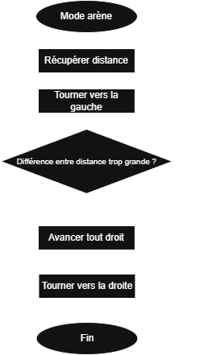

# mbot-V1-rescue-line

Ce repo contient le rapport entier de notre projet (Gabriel et Brice) sur le robot Rescue Line pour le projet de Science de l'ingénieur 2025.

## I - Suivi de ligne

### 1) Introduction au robot

-------------------------------------------------------------------------------------------------------------------------------------------------------------------------------------------------------------------------

Le robot part d'une base mbot V1. Il fonctionne avec, pour la partie suivi de ligne, 2 modules, un module de suivi de ligne et un module de détection de couleur. De plus, il a 2 moteurs principaux reliés à 2 roues, ainsi qu'une roue universelle à bille en acier sous vide à l'avant pour faire tenir le robot.

-------------------------------------------------------------------------------------------------------------------------------------------------------------------------------------------------------------------------

### 2) Principe de détection

-------------------------------------------------------------------------------------------------------------------------------------------------------------------------------------------------------------------------

La détection de la ligne est assurée par le module de suivi de ligne.

Ce module est composé de 2 capteurs qui vérifie si ils sont sur une ligne noir ou pas. Ainsi, ces capteurs sont utilisés pour vérifier si le robot est bien aligné avec la ligne. Si l'un des capteurs sort, le moteur du même côté que le capteur sortie accélère pour redresser le robot et le robot se prépare à un tournant du côté inverse du côté du capteur. Si les 2 capteurs sortent cela veut dire qu'il y a un tournant, ainsi le robot tourne dans le sens dans lequel il s'est préparé. ([Voir ligne 169 à 241](rescue_line.ino#L169-L241))

Le module de détection couleur assure, lui, la détection de la ligne rouge finale.

Ce module est lui aussi composé de 2 capteurs mais eux détectent les différentes teintes (RGB) des couleurs. Ce module au moment de passer la ligne finale va détecter la couleur et fera passer le robot en mode Arène ([voir 2.2](#2-principe-de-capture)). Il est positionné sur la gauche du robot.

-------------------------------------------------------------------------------------------------------------------------------------------------------------------------------------------------------------------------

### 3) Algorithme mode suivi de ligne

-------------------------------------------------------------------------------------------------------------------------------------------------------------------------------------------------------------------------

-------------------------------------------------------------------------------------------------------------------------------------------------------------------------------------------------------------------------

### 4) Conclusion

-------------------------------------------------------------------------------------------------------------------------------------------------------------------------------------------------------------------------

Plusieurs difficultés ont été rencontrées. Le positionnement du module de détection des couleurs était complexe pour à la fois ne pas surélever le robot et le positionner au bon endroit. De plus, la détection prend beaucoup de temps, il fallait donc la faire le moins possible, au bon endroit, pile pour détecter à tous les coups sans perte dans la vitesse du robot. Le comportement final est satisfaisant mais fait défaut de temps en temps pour des raisons compliquées à cerner.

## II - Récupération de la balle

### 1) Géométrie de la pince

-------------------------------------------------------------------------------------------------------------------------------------------------------------------------------------------------------------------------

La pince a été faite pour être résistante, elle est donc plutôt épaisse et pas trop grande pour éviter d'avoir trop de poids. Une partie pour l'accrocher à l'avant du robot a été désigné, d'abord pour la rentrer dans les espaces adéquoits à l'avant mais pour une fonctionnalité expliqué plus tard ([pour comprendre le choix voir 2.4](#4-conclusion-1)), ensuite nous l'avons accroché à un servo moteur. La partie avant de la pince est assez longue pour récupérer la balle. ([Voir modélisation](pasdelien))

-------------------------------------------------------------------------------------------------------------------------------------------------------------------------------------------------------------------------

### 2) Principe de capture

-------------------------------------------------------------------------------------------------------------------------------------------------------------------------------------------------------------------------

Le robot a deux modes, le mode ligne de base pour suivre la ligne, et le mode arène pour capturer la balle. Comme dit avant une fois la ligne rouge détectée, le robot se met en mode arène. ([Voir ligne 217 et 218](rescue_line.ino#L217-L218))

Une fois en mode arène, il fallait réfléchir à la façon de trouver la balle. D'abord partie sur une base de recherche de la balle à l'aveugle, après un peu de réflexion, nous nous sommes demandé comment la détecter. Là nous est venu l'idée de regarder la différence absolue entre deux prises de mesures, pendant que le robot tourne, du capteur ultrason pour voir si elle était significative. Si elle l'est ainsi cela veut dire qu'il y a une anomalie et dans notre cas cela est obligatoirement la balle. ([Voir ligne 118](rescue_line.ino#L118))

Ainsi, une fois la balle détectée, le robot s'arrête de tourner sur lui-même et avance tout droit vers la balle pour la bloquer contre le mur du fond et tourne violemment vers la droite pour la rentrer directement dans le coin droit de l'arrivée. ([Voir ligne 119 à 130](rescue_line.ino#L119-130))

-------------------------------------------------------------------------------------------------------------------------------------------------------------------------------------------------------------------------

### 3) Algorithme mode arène

-------------------------------------------------------------------------------------------------------------------------------------------------------------------------------------------------------------------------

-------------------------------------------------------------------------------------------------------------------------------------------------------------------------------------------------------------------------

### 4) Conclusion

-------------------------------------------------------------------------------------------------------------------------------------------------------------------------------------------------------------------------

Une grosse difficulté a été rencontrée, comment mettre au même niveau que la balle le capteur à ultrason alors que la pince est dans le chemin. Cela a été réglé en ajoutant un servo moteur pour lever la pince. Aussi, il a fallu changer la mini roue à l'avant pour qu'elle tourne mieux et qu'elle arrête de se coincer entre les tuiles. Le comportement réel était surprenament très vite proche du comportement recherché.

## III - Conclusion

Finalement, ce projet aura eu beaucoup de rebondissement, mais le résultat final est plutôt convaincant. Merci d'avoir lu !
